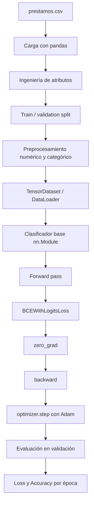

# Pre-entrega: Pipeline de entrenamiento, validación y clasificador base

## Proyecto

Este repositorio contiene un pipeline base de Deep Learning en PyTorch para un problema de clasificación binaria de riesgo crediticio usando el dataset `prestamos.csv`.

La entrega está pensada como un repositorio de código fuente funcional, no como un contenedor de PDFs. El archivo principal evaluable es:

```text
src/train.py
```

También se incluye una versión notebook en:

```text
notebooks/pipeline_base_pytorch.ipynb
```

## Variable objetivo

La columna objetivo es:

```text
loan_status
```

Interpretación:

- `1`: crédito aprobado / perfil apto.
- `0`: crédito no aprobado / perfil riesgoso.

Como la variable objetivo tiene dos clases, el problema se modela como **clasificación binaria**.

## Estructura del repositorio

```text
entrega_modulo_iii_repo/
├── data/
│   └── prestamos.csv
├── notebooks/
│   └── pipeline_base_pytorch.ipynb
├── src/
│   └── train.py
├── .gitignore
├── README.md
└── requirements.txt
```

## Configuración del entorno

Instalar dependencias:

```bash
pip install -r requirements.txt
```

El proyecto usa PyTorch `>=2.0`. Al ejecutar el script, se imprime la versión exacta instalada en el entorno mediante:

```python
print(torch.__version__)
```

El script detecta automáticamente el dispositivo disponible:

- `cuda`, si hay GPU NVIDIA disponible.
- `mps`, si hay Apple Silicon compatible.
- `cpu`, si no hay acelerador disponible.

## Cómo ejecutar

Desde la raíz del repositorio:

```bash
python src/train.py
```

También se pueden modificar hiperparámetros:

```bash
python src/train.py --epochs 10 --batch-size 128 --learning-rate 0.001
```

## Arquitectura base

Se implementa un clasificador base con `nn.Module` y `nn.Sequential`:

- `Linear(input_dim, 64)`
- `ReLU`
- `Dropout(0.20)`
- `Linear(64, 32)`
- `ReLU`
- `Linear(32, 1)`

Como el problema es binario, la salida del modelo tiene una neurona y se entrena con:

```python
nn.BCEWithLogitsLoss()
```

## Hiperparámetros principales

- `learning_rate`: `0.001`
- `batch_size`: `128`
- `epochs`: `10`
- Optimizador: `Adam`
- Loss: `BCEWithLogitsLoss`

El `learning_rate=0.001` se usa como valor inicial estándar para Adam porque suele ofrecer entrenamiento estable en redes pequeñas.

## Pipeline implementado

El archivo `src/train.py` implementa:

- Fijación de semillas para reproducibilidad.
- Detección automática de dispositivo (`cuda`, `mps`, `cpu`).
- Carga del dataset desde `data/prestamos.csv`.
- Ingeniería de atributos simple.
- Separación entrenamiento/validación con `train_test_split`.
- Preprocesamiento de variables numéricas y categóricas.
- Conversión a tensores.
- `Dataset` y `DataLoader`.
- Modelo base con `nn.Module`.
- Training loop explícito:
  - forward pass
  - cálculo de pérdida
  - `optimizer.zero_grad()`
  - `loss.backward()`
  - `optimizer.step()`
- Validación separada con `model.eval()` y `torch.no_grad()`.
- Tracking de `loss` y `Accuracy` por época.
- Exportación de resultados a `training_history.csv`.

## Diagrama conceptual



## Interpretación esperada de la curva de pérdida

Durante las épocas, el script imprime:

- `train_loss`
- `train_accuracy`
- `val_loss`
- `val_accuracy`

Se espera que la pérdida de entrenamiento disminuya con las épocas. Si la pérdida de validación también baja o se mantiene estable, el modelo está aprendiendo sin señales fuertes de overfitting. Si la pérdida de entrenamiento baja pero la de validación sube, eso puede indicar sobreajuste.

El script guarda el historial en:

```text
training_history.csv
```

## Criterios de evaluación cubiertos

- Código fuente disponible en `.py` y `.ipynb`.
- Repositorio organizado con `data/`, `src/`, `notebooks/`, `README.md` y `requirements.txt`.
- Uso de PyTorch, `torch.nn` y `torch.optim`.
- Detección de dispositivo.
- Arquitectura base con `nn.Module`.
- Training loop con `zero_grad()`, `backward()` y Adam.
- Validación separada.
- Métricas por época: pérdida y Accuracy.
- README documentando configuración, learning rate e interpretación de la pérdida.
